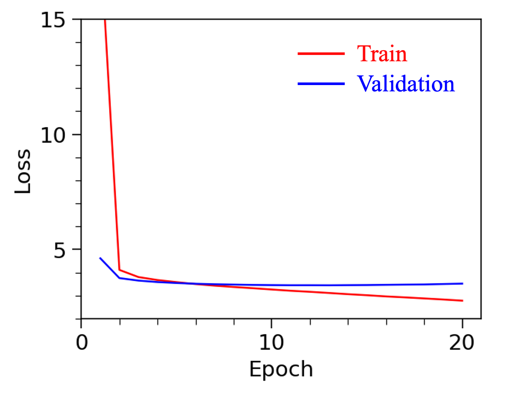

## General
This example demonstrates funetuning GPT model for language modeling tasks. 

## Dataset
The dataset contains the text from the first book of the "Harry Potter" series.

Dataset Link: https://www.kaggle.com/datasets/prashantkarwasra/books-dataset-text-generation/data

## Model
The model is GPT2 (Generative Pre-Training) Small model with a language modeling head (GPT2LMHeadModel). The model consists of the embedding layer, 12 decoder layers. The weights of the 10th and 11th decoder layers (0 index) are finetuned for 20 epoches, with all other model parameters frozen.

## Evaluation

**Figure 1. Loss on the train and valiation dataset.**

| | Loss | Perplexity |
| --- | --- | --- |
| Train | 2.79 | 16.24 |
| Validation | 3.45 | 31.36 |
| Test | 3.44 | 31.26 |

**Table 1. Loss and perplexity on train/validation/test dataset.**

## Decoding

1. Greedy  
> "I'm not sure what's going on," said Ron. "I don't know what's going on. I don't know what's going on."

2. Beam search  
> "I don’t know,” said Hagrid. “I don’t know what’s going to happen. I don’t know what’s going to happen. I don’t know what’s going to happen. I don’t know what’s going to happen. I don’t know what’s going to happen. I don’t know what’s going to happen. I don’t know what’s going to happen. I don’t know what’s going to happen

4. Beam search with repetition penalty
5. Top P (P=0.6)
6. Top K (K=20)
7. Top K with enhanced temperature (K=20, temperature=10)

Through finetuning, the model achieve an accuracy of 90.5% on the test dataset. On this balanced dataset, the model exhibits similar performance in detecting positive and negative reviews according to the confusion matrix in Table 2.

## Reference
1. https://huggingface.co/docs/transformers/en/model_doc/bert
2. Kenton, Jacob Devlin Ming-Wei Chang, and Lee Kristina Toutanova. "Bert: Pre-training of deep bidirectional transformers for language understanding." Proceedings of naacL-HLT. Vol. 1. 2019.
