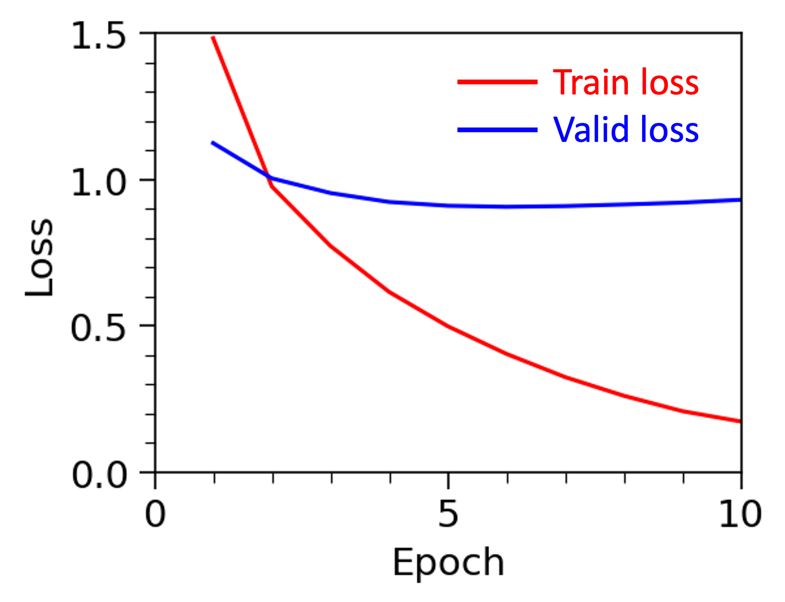

## General
This example demonstrates funetuning LLaMA model for question answering tasks. 

## Dataset
The dataset has around 40K movie reviews with positive and negative reviews labeled as 1 and 0, respectively. For the demonstration, 1K positive reviews and 1K negative reviews are sampled for finetuning the model.

Dataset Link: https://www.kaggle.com/datasets/yasserh/imdb-movie-ratings-sentiment-analysis

## Model
The model is LLaMA-3-1B (Large Language Model Meta AI) with a language modeling head (LlamaForCausalLM). The model consists of the embedding layer, 16 decoder layers. The weights of the 15th encoder layer (0 index) are finetuned for 10 epoches, with all other model parameters frozen.

When using the original model to generate answers, the prompt takes the following format:
> "||" + {Context} + " " + {Question} + " "

When using the finetuned model to generate answers, the prompt takes the following format:
> <Context> + {Context} + <Question> + {Question} + <Answer>

## Evaluation
 

**Figure 1. Loss and accuracy on the train and valiation dataset.**

| | Accuracy | Precison | Recall | F1 | 
| --- | --- | --- | --- | --- |
| Train | 0.955 | 0.955 | 0.955 | 0.955 |
| Validation | 0.878 | 0.877 | 0.876 | 0.877 |
| Test | 0.905 | 0.905 | 0.905 | 0.905 |

**Table 1. Summary of various metrics on train/validation/test dataset.**

| | 0 | 1 |
| --- | --- | --- |
| 0 | 179 | 21 |
| 1 | 17 | 183 |

**Table 2. Confusion metrix of test dataset. 1 and 0 represents the positive and negative reviews, respectively.**

Through finetuning, the model achieve an accuracy of 90.5% on the test dataset. On this balanced dataset, the model exhibits similar performance in detecting positive and negative reviews according to the confusion matrix in Table 2.

## Reference
1. https://huggingface.co/docs/transformers/en/model_doc/bert
2. Kenton, Jacob Devlin Ming-Wei Chang, and Lee Kristina Toutanova. "Bert: Pre-training of deep bidirectional transformers for language understanding." Proceedings of naacL-HLT. Vol. 1. 2019.
