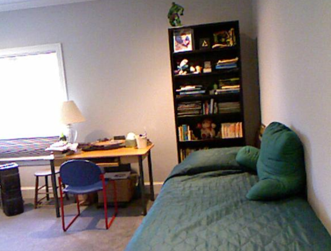
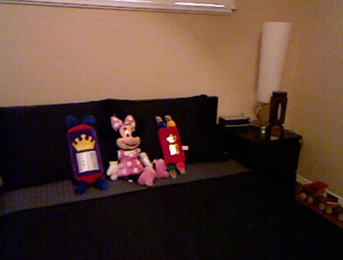

## General
This example demonstrates funetuning BLIP model for visual question answering multimodal tasks. 

## Dataset
The original dataset consists of a training split containing around 10K question answer pairs, and a test split containing 3K question answer pairs. Each question answer pair is related to one image. In this example, 1K instances from the training split are sampled for finetuning the model, of which 80% is used for training and 20% is used for validation. 1K instances from the test split are sampled for testing the model performance.

Dataset Link: https://www.kaggle.com/datasets/bhavikardeshna/visual-question-answering-computer-vision-nlp

## Model
The model is BLIP (Bootstrapping Language-Image Pre-training) with a question answering head (BlipForQuestionAnswering) from Hugging Face. It consists of both transformer encoders and decoders. The encoders include a vision encoder which encodes the image and a text encoder which encodes the question together with the image. The decoder generates the answer according to the image and question. The vision encoder, text encoder and text decoder all consists of 12 BERT model encoder blocks. Notably, for the text decoder, the bidirectional self-attention is replaced with the casual self-attention for the purpose of language modeling. The weights of the classification layer in the decoder model is finetuned for 20 epoches, with all other model parameters frozen.

## Evaluation

**Figure 1. Loss on the train and valiation dataset during training.**

**Figure 1. Recall for various number of predictions for each instance on the test dataset.**

Through finetuning, the model improves from 0.29 to 0.50 on ROUGE score, and from 0.19 to 0.34 on BLEU score, respectively, on the test dataset via beam search. Moreover, compared with greedy decoding, the beam search helps improve the decoding quality slightly. For example, the ROUGE score improves from 0.47 for greedy decoding to 0.50 for beam search. 

## Decoding
This section shows two examples of generating answer for the given question based on the image. 

> Quesion: "how many chairs are there"  
> Target Answer: "1"  

> Generated Answers Before Finetuning: "2", "two", "one", $${\color{red}"1"}$$, "0", "3", "there is no table in picture", "there are two", "4", "there are 2"  

> Generated Answers After Finetuning: "2", $${\color{red}"1"}$$, "3", "4", "2 decorative vases", "2", "2 ornamental vases", "2 decorative vases 2 decorative vases", "2 decorative vases 3 decorative vases", "2 vases"

> Quesion: "what is right of sofa"  
> Target Answer: "lamp"  

> Generated Answers Before Finetuning: "table is made of wood", "tall and narrow", "it is made of wood", "table is made out of wood", "lamppost", "tall wooden pole", "it is made out of wood", "lampshade", "table is made of metal", "tall wooden fence"  

> Generated Answers After Finetuning: "table", $${\color{red}"lamp"}$$, "lamppost", "decorative item", "table in front of window", "table runner", "table in front of person", "decorative item in person ' s hand", "table in front of curtain", "table lamp"

Here, the beam search generates a good answer while the greedy search fails to answers the question correctly.

## Reference
1. https://huggingface.co/docs/transformers/en/model_doc/llama3
2. Touvron, Hugo, et al. "Llama: Open and efficient foundation language models." arXiv preprint arXiv:2302.13971 (2023).
