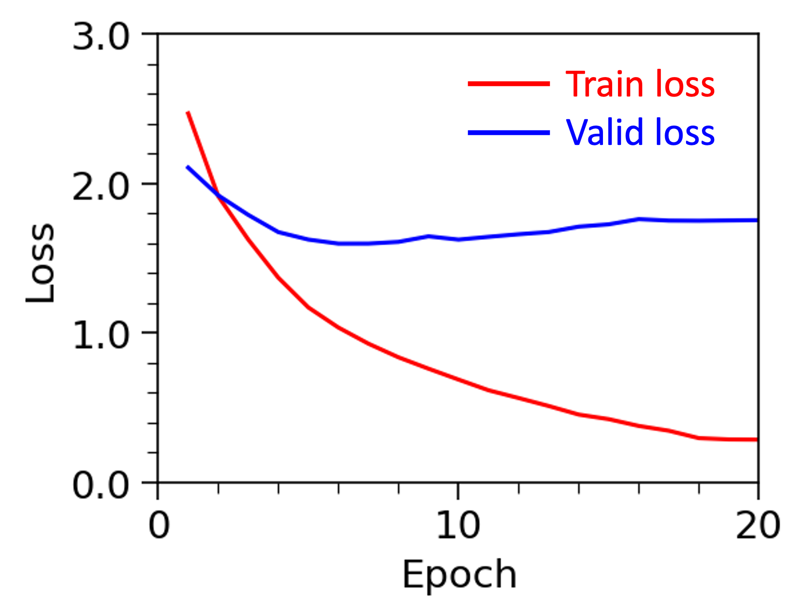
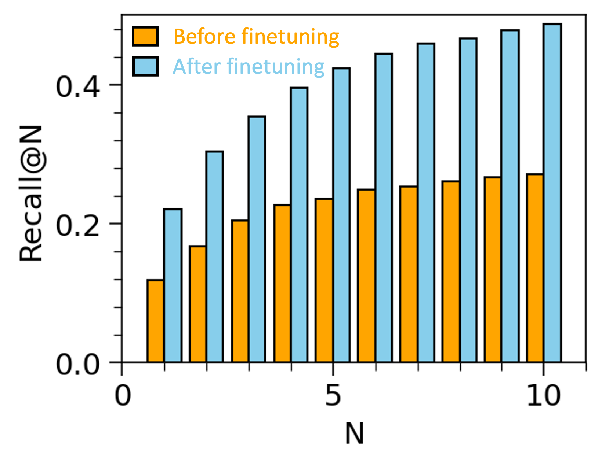

## General
This example demonstrates funetuning LLaMA model for question answering tasks. 

## Dataset
The original dataset has around 10K question answer pairs from financial reports. Each instance includes a question, answer, and context from which the answer is extracted. In this example, 1K instances are sampled for finetuning the model. The dataset is splited into three parts, 60% for training, 20% for validation and 20% for testing.

Dataset Link: https://www.kaggle.com/datasets/yousefsaeedian/financial-q-and-a-10k

## Model
The model is LLaMA-3-1B (Large Language Model Meta AI) with a language modeling head (LlamaForCausalLM) from Hugging Face. The model consists of the embedding layer, 16 decoder layers. The weights of the 15th decoder layer (index starting from 0) are finetuned for 10 epoches, with all other model parameters frozen.

When using the original model to generate answers as benchmarks, the prompt takes the following format:
> "\<|begin_of_text|\>" + {Context} + "\n" + {Question} + "\n"

Here, the "\<|begin_of_text|\>" represents the start of the sentence token, and "\n" represents the new line which is used to seperate the context, question and answer. {Context} and {Question} indicates the content of the context and question.

When using the finetuned model to generate answers, the prompt takes the following format:
> "\<Context\>" + {Context} + "\<Question\>" + {Question} + "\<Answer\>"

Here, the "\<Context\>", "\<Question\>" and "\<Answer\>" are newly added tokens to help indicate the start of the context, question and answer. Meanwhile, the special tokens including start of sentence, end of sentence, unknown, and padding tokens are specified. As a result, the embedding layer is finetuned because of the introduction of these new tokens. Similarly, {Context} and {Question} indicates the content of the context and question.

## Evaluation

**Figure 1. Loss on the train and valiation dataset during training.**

**Figure 1. Recall for various number of predictions for each instance on the test dataset.**

Through finetuning, the model improves from 0.29 to 0.50 on ROUGE score, and from 0.19 to 0.34 on BLEU score, respectively, on the test dataset via beam search. Moreover, compared with greedy decoding, the beam search helps improve the decoding quality slightly. For example, the ROUGE score improves from 0.47 for greedy decoding to 0.50 for beam search. 

## Decoding
This section shows two examples of generating answer for the given question based on the image. 

## Evaluation
> 
> Quesion: "how many chairs are there"
> Target Answer: "1"
> 

Context
> During fiscal year 2023, we returned $10.44 billion to shareholders in the form of share repurchases and cash dividends.

Question
> How much did the company return to shareholders in the form of share repurchases and cash dividends during fiscal year 2023?

Target Answer
> The company returned $10.44 billion to shareholders in the form of share repurchases and cash dividends during fiscal year 2023.

Generated Answer from Greedy Decoding
> The company repurchased 1.3 billion shares in fiscal year 2023, which was a 3% decrease from the previous year.

Generated Answer from Beam Search
> The company returned $10.44 billion to shareholders in the form of share repurchases and cash dividends during fiscal year 2023.

Here, the beam search generates a good answer while the greedy search fails to answers the question correctly.

## Reference
1. https://huggingface.co/docs/transformers/en/model_doc/llama3
2. Touvron, Hugo, et al. "Llama: Open and efficient foundation language models." arXiv preprint arXiv:2302.13971 (2023).
